# SPRING PLUS

작성자 : Spring 2기 윤민기

***
## Level 1

### 1. 코드 개선 퀴즈 @Transactional의 이해 

문제 원문

- 할 일 저장 기능을 구현한 API(`/todos`)를 호출할 때, 아래와 같은 에러가 발생하고 있어요.
 
에러 로그 원문

jakarta.servlet.ServletException: Request processing failed: org.springframework.orm.jpa.JpaSystemException: could not execute statement [Connection is read-only. Queries leading to data modification are not allowed] [insert into todos (contents,created_at,modified_at,title,user_id,weather) values (?,?,?,?,?,?)]

- 에러가 발생하지 않고 정상적으로 할 일을 저장 할 수 있도록 코드를 수정해주세요.

해결 방법

Todo Service에서 readOnly 옵션을 지정해 두었기에 데이터의 할 일 저장 기능이 구현되어있는 API에서 데이터 수정 작업이 불가능 한 문제가 발생한것이다.
따라서 readOnly 옵션을 제거해줌으로써 문제를 해결하였다.

[수정 기록 커밋] https://github.com/f-api/spring-plus/commit/a42e191e75fddf894857cafc29a9bd558be8bf10

***

### 2. 코드 추가 퀴즈 - JWT의 이해

문제 원문

🚨 기획자의 긴급 요청이 왔어요!
아래의 요구사항에 맞춰 기획 요건에 대응할 수 있는 코드를 작성해주세요.

- User의 정보에 nickname이 필요해졌어요.
    - User 테이블에 nickname 컬럼을 추가해주세요.
    - nickname은 중복 가능합니다.
- 프론트엔드 개발자가 JWT에서 유저의 닉네임을 꺼내 화면에 보여주길 원하고 있어요.

해결 방법

프론트엔드에서 JWT를 통해 별명을 꺼내어 쓸 수 있도록 하는 과정의 파이프라인으로는
1. DB에서 사용할 엔티티에 별명 칼럼 추가
2. JWT의 토큰 생성 로직에 추가된 별명 칼럼 반영
3. 인증 객체에 추가된 별명 반영

을 순서대로 작업해야한다.

[수정 기록 커밋] https://github.com/f-api/spring-plus/commit/ab00ae50c1005f1915709a961b0a22427beae6a9

***
### 3. 코드 개선 퀴즈 - JPA의 이해

문제 원문 
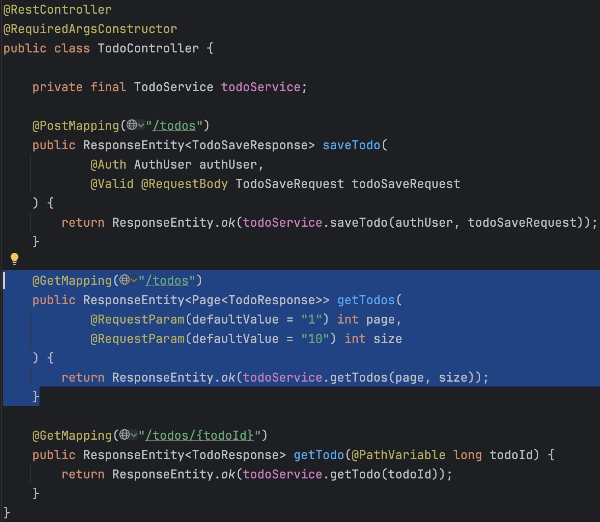

<aside>
🚨 기획자의 긴급 요청이 왔어요!
아래의 요구사항에 맞춰 기획 요건에 대응할 수 있는 코드를 작성해주세요.

</aside>

- 할 일 검색 시 `weather` 조건으로도 검색할 수 있어야해요.
    - `weather` 조건은 있을 수도 있고, 없을 수도 있어요!
- 할 일 검색 시 수정일 기준으로 기간 검색이 가능해야해요.
    - 기간의 시작과 끝 조건은 있을 수도 있고, 없을 수도 있어요!
- JPQL을 사용하고, 쿼리 메소드명은 자유롭게 지정하되 너무 길지 않게 해주세요.

<aside>
💡 필요할 시, 서비스 단에서 if문을 사용해 여러 개의 쿼리(JPQL)를 사용하셔도 좋습니다.

</aside>

해결 방법

기존에 있던 레포지토리에 weather와 수정일을 기준으로 기간 검색이라는 조건이 붙은 검색 코드를 새로 만들어주어야 한다.
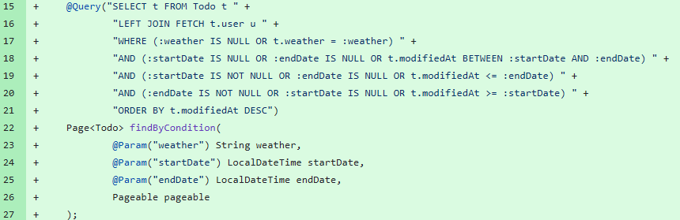

위 사진의 쿼리를 추가해 줌으로 써 필요로하는 검색 쿼리를 작성했다.
이후 검색 쿼리가 달라짐에 따라 서비스 코드와 컨트롤러의 코드의 수정이 필요해졌다.

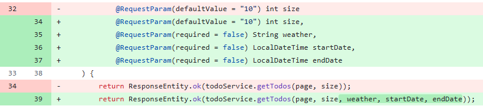

기존 page의 정보만을 전달하던 컨트롤러 코드에서 날씨와 날짜 기간을 위한 시작일과 종료일 인자를 추가로 전달해주는 코드로 변경하였다.

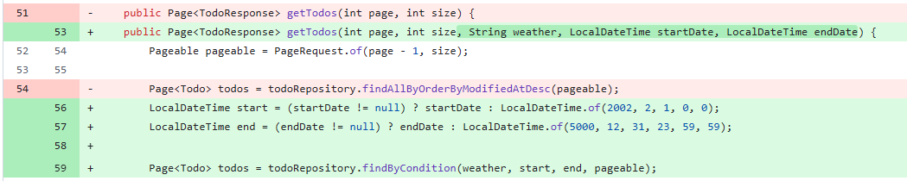

서비스 코드 또한 기존의 인자로는 부족하기에 추가된 인자들을 추가해주고, 변경된 레포지토리의 메소드와 검색을 위한 시작일과 종료일을 추가해주었다.

[수정 기록 커밋] https://github.com/f-api/spring-plus/commit/3fd8b19116c56908a8c33352b1c114014ddbed4a

***
### ### **4. 테스트 코드 퀴즈 - 컨트롤러 테스트의 이해**

문제 원문

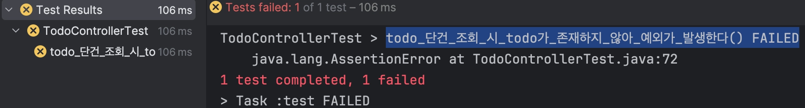

- 테스트 패키지 `org.example.expert.domain.todo.controller`의
  `todo_단건_조회_시_todo가_존재하지_않아_예외가_발생한다()` 테스트가 실패하고 있어요.

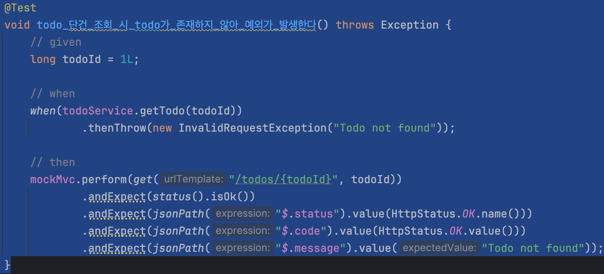

- 테스트가 정상적으로 수행되어 통과할 수 있도록 테스트 코드를 수정해주세요.

해결 방법

코드를 실행해본 결과 todo가 존재하지 않아서 예외가 발생한다는 상황에서 200 Ok 의 response를 테스트코드에서 받기를 기대하고 있다.

하지만, 위 상황에서는 200 OK가 아니라 400 Bad Request 혹은 404 Not Found가 어울리는 response일 것이다. 이에 따라 예외가 발생했을 경우를 대비한 코드로 수정해주었다.

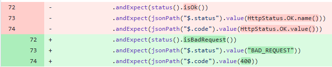

[수정 기록 커밋] https://github.com/f-api/spring-plus/commit/9305d07e51f75cbd08b8881feb1eb01e40d90464

***
### 5. 코드 개선 퀴즈 - AOP의 이해
문제 원문

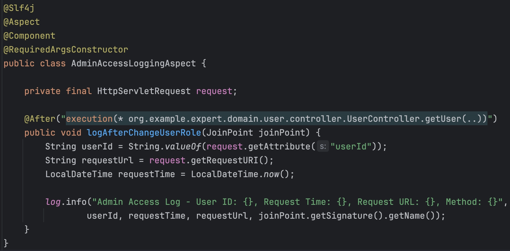

<aside>
😱 AOP가 잘못 동작하고 있어요!

</aside>

- `UserAdminController` 클래스의 `changeUserRole()` 메소드가 실행 전 동작해야해요.
- `AdminAccessLoggingAspect` 클래스에 있는 AOP가 개발 의도에 맞도록 코드를 수정해주세요.

해결 방법

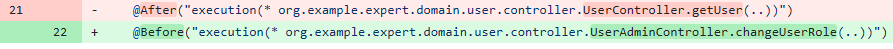
- `UserAdminController` 클래스의 `changeUserRole()` 메소드가 실행 전 동작해야해요.
의 조건을 만족하기 위해서는 @After 어노테이션이 아닌 @Before 어노테이션을 필요로 하기에 수정해 주었다.
- `AdminAccessLoggingAspect` 클래스에 있는 AOP가 개발 의도에 맞도록 코드를 수정해주세요.
기존의 유저 컨트롤러의 조회 기능인 getUser 메소드가 아닌 유저 어드민 컨트롤러의 changeUserRole 메소드를 로깅하는것이 더 자연스러운 것 같다고 보여 수정해주었다.
README를 작성중에 생각한 부분이지만, 누가 바꿨느냐만 포함하는 것이 아니라 누구의 역할을 바꾸었는지도 추가했으면 좋을것같다.

[수정 기록 커밋] https://github.com/f-api/spring-plus/commit/45cf9fbc8e3ad01cbcd38b42dbf283b532af985a
***

## Level 2
### 1. JPA Cascade

문제 원문 
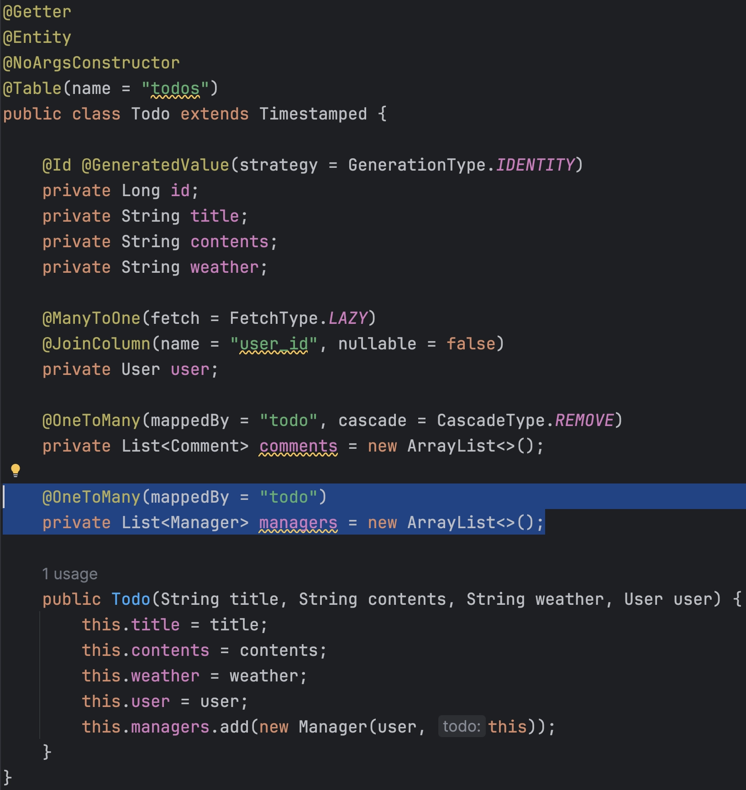
<aside>
🤔 앗❗ 실수로 코드를 지웠어요!

</aside>

- 할 일을 새로 저장할 시, 할 일을 생성한 유저는 담당자로 자동 등록되어야 합니다.
- JPA의 `cascade` 기능을 활용해 할 일을 생성한 유저가 담당자로 등록될 수 있게 해주세요.

해결 방법
CascadeType.PERSIST를 @OneToMany에 옵션으로 붙여줌으로써 Todo가 저장될때 Maneger도 같이 저장되게 만들어주었다.

[수정 기록 커밋] https://github.com/f-api/spring-plus/commit/2aa917f3df8b89a2bed10bd9516bdeb3f00eaeb6
***
## 2. N+1

문제 원문

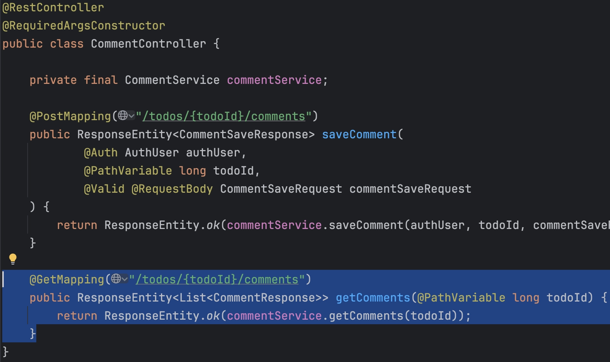

- `CommentController` 클래스의 `getComments()` API를 호출할 때 N+1 문제가 발생하고 있어요. N+1 문제란, 데이터베이스 쿼리 성능 저하를 일으키는 대표적인 문제 중 하나로, 특히 연관된 엔티티를 조회할 때 발생해요.
- 해당 문제가 발생하지 않도록 코드를 수정해주세요.
- N+1 로그
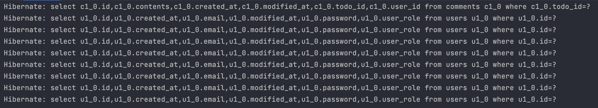

해결 방법
코드를 확인해보니 퀴리에서 Join을 사용하고 있었다. 이때문에 N + 1 문제가 발생하는것 같다. FETCH JOIN으로 바꾸어 주도록 하자
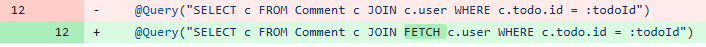

[수정 기록 커밋] https://github.com/f-api/spring-plus/commit/9ef5c776c5657edd74a3fe4232820c2f77ae2def

***
## 3. QueryDSL

문제 원문 
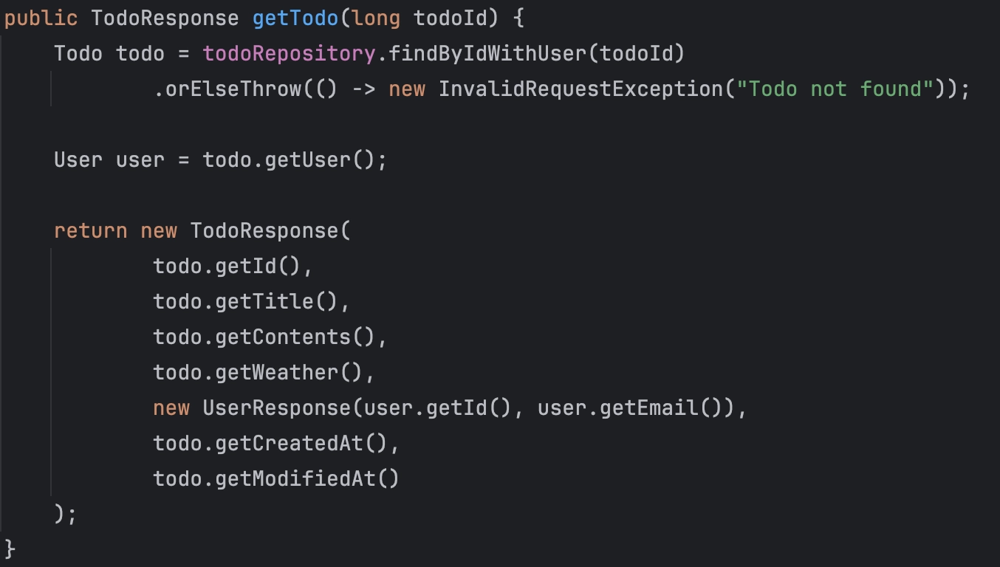

- JPQL로 작성된 `findByIdWithUser` 를 QueryDSL로 변경합니다.
- 7번과 마찬가지로 N+1 문제가 발생하지 않도록 유의해 주세요!

해결 방법
가장 먼저 Custome Repository를 만들어준다.
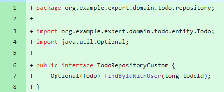

이후 실제로 QueryDSL을 날려줄 TodoRepositoryCustomImpl 구현체를 만들어준다. 이때 N + 1 문제를 미리 예방하기 위해서 fetchjoin을 사용해주었다.

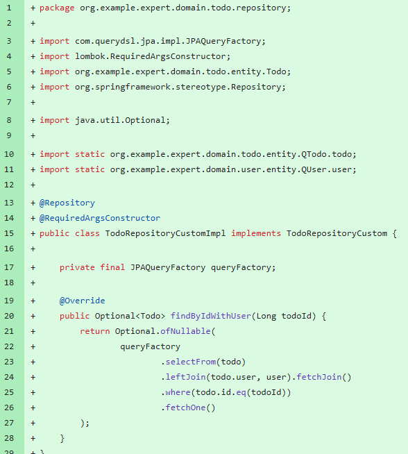

이후 findByIdWithUser메소드를 새로 작성해줌에 따라서 기존 메소드를 삭제해주었다.
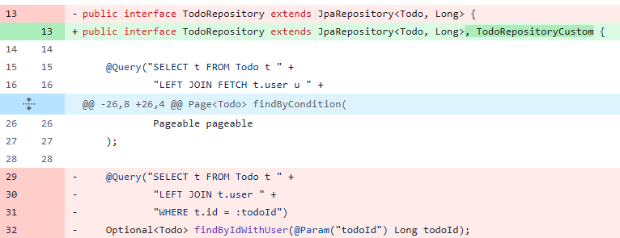

트러블 슈팅

관련 의존성이 부여가 되어있지않은 바람에 build.gradle에 querydsl 관련 의존성을 먼저 부여해주었다.
이후 JPAQueryFactory를 config 경로에 새로 만들어주어 @Configuration으로 직접 빈 등록을 해 주었으며,
Qclass들이 하나도 생성되어 있지 않기에 컴파일을 한번 거쳐줌으로써 QTodo와 Quser등의 파일등을 미리 생성해주었다.

[수정 기록 커밋] https://github.com/f-api/spring-plus/commit/c6cc8e56d2e9f1f47c0537dc43b61da1830343ec#diff-fef9ef0f27224b287e1019151d98e11117a98dd8c2083033c111e1ccf09cd6b3

***
## 4. Spring Security
문제 원문
Spring Security를 도입하기로 결정했어요!

- 기존 `Filter`와 `Argument Resolver`를 사용하던 코드들을 Spring Security로 변경해주세요.
    - 접근 권한 및 유저 권한 기능은 그대로 유지해주세요.
    - 권한은 Spring Security의 기능을 사용해주세요.
- 토큰 기반 인증 방식은 유지할 거예요. JWT는 그대로 사용해주세요.

해결 방안
가장 먼저 security 세팅에 필요한 의존성을 추가해주었다.

이후 기존에 사용하던 커스텀 필터를 대체할 Jwt 인증 필터를 작성해주었다.

이후 기존의 필터 설정을 대체할 SecurityConfig를 작성해주었고, AuthUser DTO를 수정해 줌으로써 Spring Securty의 UserDetails 스타일로 권한을 출력할 수 있도록 수정해주었다,

이후 ArgumentResolver를 사용하지 않게 됨에 따라 기존의 모든 컨트롤러에 붙어있던 @Auth 어노테이션을 @AuthenticationPrincipal으로 바꾸어 주었고, 사용하지 않는 패키지등은 모두 삭제해 주었다.

[수정 기록 커밋] https://github.com/f-api/spring-plus/commit/3ba1a5262cecda4efdafaaabfaa198840be37d46#diff-8145b3e977bb69a032163206124403ea8bc8cc8fd4083faf9b481b0d930349ef

***
