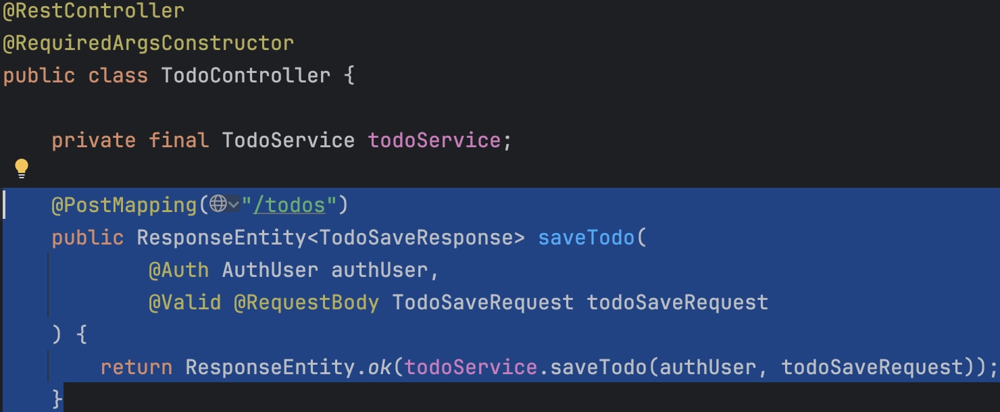
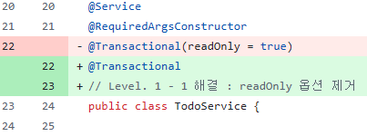

# SPRING PLUS

작성자 : Spring 2기 윤민기

***
## Level 1

### 1. 코드 개선 퀴즈 @Transactional의 이해 

문제 원문

- 할 일 저장 기능을 구현한 API(`/todos`)를 호출할 때, 아래와 같은 에러가 발생하고 있어요.
 
에러 로그 원문

jakarta.servlet.ServletException: Request processing failed: org.springframework.orm.jpa.JpaSystemException: could not execute statement [Connection is read-only. Queries leading to data modification are not allowed] [insert into todos (contents,created_at,modified_at,title,user_id,weather) values (?,?,?,?,?,?)]

- 에러가 발생하지 않고 정상적으로 할 일을 저장 할 수 있도록 코드를 수정해주세요.

해결 방법

Todo Service에서 readOnly 옵션을 지정해 두었기에 데이터의 할 일 저장 기능이 구현되어있는 API에서 데이터 수정 작업이 불가능 한 문제가 발생한것이다.
따라서 readOnly 옵션을 제거해줌으로써 문제를 해결하였다.

[수정 기록 커밋] https://github.com/f-api/spring-plus/commit/a42e191e75fddf894857cafc29a9bd558be8bf10

***

### 2. 코드 추가 퀴즈 - JWT의 이해

문제 원문

🚨 기획자의 긴급 요청이 왔어요!
아래의 요구사항에 맞춰 기획 요건에 대응할 수 있는 코드를 작성해주세요.

- User의 정보에 nickname이 필요해졌어요.
    - User 테이블에 nickname 컬럼을 추가해주세요.
    - nickname은 중복 가능합니다.
- 프론트엔드 개발자가 JWT에서 유저의 닉네임을 꺼내 화면에 보여주길 원하고 있어요.

해결 방법

프론트엔드에서 JWT를 통해 별명을 꺼내어 쓸 수 있도록 하는 과정의 파이프라인으로는
1. DB에서 사용할 엔티티에 별명 칼럼 추가
2. JWT의 토큰 생성 로직에 추가된 별명 칼럼 반영
3. 인증 객체에 추가된 별명 반영

을 순서대로 작업해야한다.

[수정 기록 커밋] https://github.com/f-api/spring-plus/commit/c31ddfa122ecc43b3882852e0b663e5802e95e2b

